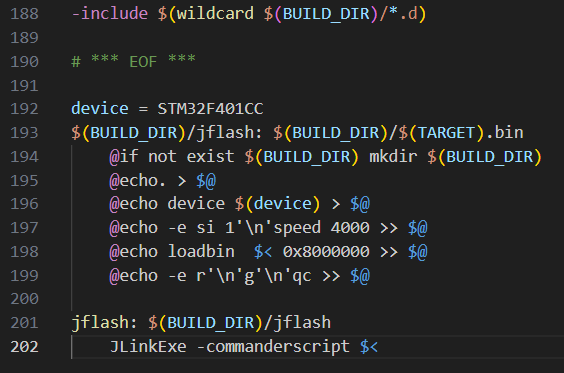

# STM32_JLINK_VSC

Làm theo các bước sau để config VSC:
1. Khởi tạo thư mục project
2. Vào Makefile tổng, add đoạn code bên dưới vào Cuối file(Ngay bên dưới chuỗi EOF) !! Bạn cần sửa device theo device của bạn
```
device = STM32F401CC
$(BUILD_DIR)/jflash: $(BUILD_DIR)/$(TARGET).bin
	@if not exist $(BUILD_DIR) mkdir $(BUILD_DIR)
	@echo. > $@
	@echo device $(device) > $@
	@echo -e si 1'\n'speed 4000 >> $@
	@echo loadbin  $< 0x8000000 >> $@
	@echo -e r'\n'g'\n'qc >> $@

jflash: $(BUILD_DIR)/jflash
	JLinkExe -commanderscript $<
```

3. Chạy lệnh make jflash ở terminal của prj
