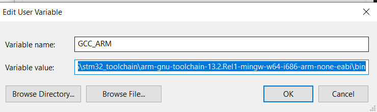
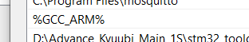
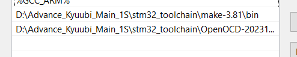

# STM32_Toolchain_VSC

Doing the following steps:
1. Extract .zip file
2. Make GCC_ARM variable in "Environment Variables" - System Variables
    value : "$ENV{TOOL_PATH}\stm32_toolchain\arm-gnu-toolchain-13.2.Rel1-mingw-w64-i686-arm-none-eabi\bin"
    
3. Add it into Path:
    
   
    Click New: "%GCC_ARM%"
    
5. Add Make path:
    "$ENV{MAKE_PATH}\stm32_toolchain\make-3.81\bin"
6. Add OpenOCD path:
    "$ENV{TOOL_PATH}\stm32_toolchain\OpenOCD-20231002-0.12.0\bin"
    
   ```
   {
    "configurations": [
        {
            "name": "Win32",
            "includePath": [
                "${workspaceFolder}/**",
                "${workspaceFolder}/Core/Inc",
                "${workspaceFolder}/Drivers/CMSIS/Device/ST/STM32F1xx/Include",
                "${workspaceFolder}/Drivers/STM32F1xx_HAL_Driver/Inc/",
                "${workspaceFolder}/Drivers/STM32F1xx_HAL_Driver/Inc/Legacy"
            ],
            "defines": [
                "_DEBUG",
                "UNICODE",
                "_UNICODE",
                "USE_HAL_DRIVER",
                "STM32F103xB"
            ],
            "compilerPath": "D:/GNU Arm Embedded Toolchain/10 2021.10/bin/arm-none-eabi-gcc.exe",
            "cStandard": "c17",
            "cppStandard": "c++17",
            "intelliSenseMode": "gcc-arm",
            "compilerArgs": [
                "-mcpu=cortex-m3"
            ],
            "configurationProvider": "ms-vscode.makefile-tools"
        }
    ],
    "version": 4
}
```
#debug session in launch.json
```
{
    // Use IntelliSense to learn about possible attributes.
    // Hover to view descriptions of existing attributes.
    // For more information, visit: https://go.microsoft.com/fwlink/?linkid=830387
    "version": "0.2.0",
    "configurations": [
        {
            "name": "Cortex Debug",
            "cwd": "${workspaceRoot}",
            "executable": "./build/AHT10_DS1307_LCD2004.elf",
            "request": "launch",
            "type": "cortex-debug",
            "servertype": "openocd",
            "device": "STM32F103C8T6",
            "configFiles": [
                "interface/stlink.cfg",
                "target/stm32f1x.cfg"
            ],
            "svdFile": ""
        }
    ]
}
```
